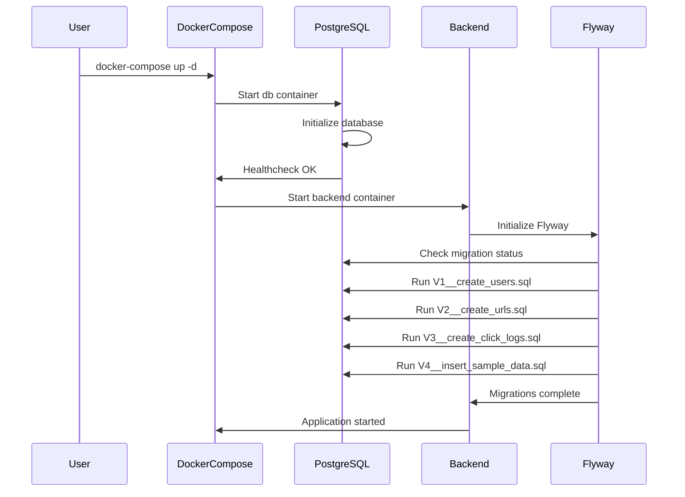

# Deployment Architecture - Unit U-005 (Database Schema)

## Purpose
This document describes the deployment architecture for the PostgreSQL database service in the URL Shortener system.

---

## Architecture Diagram

### Local Development (Docker Compose)

```
┌────────────────────────────────────────────────────────────┐
│                      Host Machine                           │
│                                                             │
│  ┌──────────────────────────────────────────────────────┐  │
│  │           Docker Compose Environment                 │  │
│  │                                                      │  │
│  │  ┌────────────────────┐                             │  │
│  │  │   frontend         │                             │  │
│  │  │   (React + Nginx)  │                             │  │
│  │  │   Port: 3000 → 80  │                             │  │
│  │  └──────────┬─────────┘                             │  │
│  │             │ HTTP                                   │  │
│  │             ▼                                        │  │
│  │  ┌────────────────────┐                             │  │
│  │  │   backend          │                             │  │
│  │  │   (Spring Boot)    │                             │  │
│  │  │   Port: 8080       │                             │  │
│  │  └──────────┬─────────┘                             │  │
│  │             │ JDBC (jdbc:postgresql://db:5432)      │  │
│  │             ▼                                        │  │
│  │  ┌────────────────────┐      ┌──────────────────┐   │  │
│  │  │   db               │◄─────│  db-data         │   │  │
│  │  │   (PostgreSQL 15)  │      │  (Volume)        │   │  │
│  │  │   Port: 5432       │      │  Persistent      │   │  │
│  │  └────────────────────┘      └──────────────────┘   │  │
│  │             ▲                                        │  │
│  │             │ Flyway Migrations (V1 → V4)           │  │
│  │             │ (Auto-run on backend startup)         │  │
│  │             │                                        │  │
│  │  ┌──────────────────────────────────────────────┐   │  │
│  │  │        urlshortener-network (bridge)         │   │  │
│  │  │  Internal DNS: db, backend, frontend         │   │  │
│  │  └──────────────────────────────────────────────┘   │  │
│  └──────────────────────────────────────────────────────┘  │
│                                                             │
│  Exposed Ports to Host:                                    │
│  - 5432:5432 (PostgreSQL) - localhost only                 │
│  - 8080:8080 (Backend API)                                 │
│  - 3000:80   (Frontend UI)                                 │
└────────────────────────────────────────────────────────────┘
```

---

## Component Breakdown

### 1. Database Container (`db`)

**Base Image**: `postgres:15`
**Container Name**: `urlshortener-db`
**Internal Hostname**: `db` (Docker DNS)
**Exposed Port**: `5432` (PostgreSQL default)

**Environment Variables**:
- `POSTGRES_DB=urlshortener` - Database name
- `POSTGRES_USER=admin` - Admin username
- `POSTGRES_PASSWORD=secret` - Admin password (학습용)

**Volume Mount**:
- `db-data:/var/lib/postgresql/data` - 데이터 영속성

**Healthcheck**:
- Command: `pg_isready -U admin`
- Interval: 10s
- Retries: 5

---

### 2. Persistent Volume (`db-data`)

**Type**: Named Docker Volume
**Driver**: `local`
**Mount Point**: `/var/lib/postgresql/data`

**Lifecycle**:
- Created: First `docker-compose up`
- Persisted: Survives container restarts
- Deleted: Only with `docker-compose down -v`

**Data Stored**:
- PostgreSQL database files
- WAL (Write-Ahead Log) files
- Configuration files

---

### 3. Network (`urlshortener-network`)

**Type**: Bridge network
**Driver**: `bridge`
**Scope**: Local to Docker Compose stack

**Connected Services**:
- `db` (PostgreSQL)
- `backend` (Spring Boot)
- `frontend` (React + Nginx)

**Service Discovery**:
- Internal DNS auto-resolves service names
- `db` → PostgreSQL container IP
- `backend` → Spring Boot container IP

---

## Deployment Flow

### 1. Initial Deployment



---

### 2. Service Startup Order

```
1. Create network: urlshortener-network
   ↓
2. Create volume: db-data
   ↓
3. Start db container
   ↓
4. Wait for db healthcheck (pg_isready)
   ↓
5. Start backend container (depends_on: db)
   ↓
6. Backend connects to db
   ↓
7. Flyway runs migrations (V1 → V4)
   ↓
8. Start frontend container (depends_on: backend)
   ↓
9. All services running
```

---

## Connection Configuration

### Backend → Database Connection

**Connection String**:
```
jdbc:postgresql://db:5432/urlshortener
```

**Connection Parameters**:
- **Host**: `db` (Docker DNS resolves to db container IP)
- **Port**: `5432`
- **Database**: `urlshortener`
- **Username**: `admin`
- **Password**: `secret`

**Spring Boot Configuration** (`application.yml`):
```yaml
spring:
  datasource:
    url: jdbc:postgresql://db:5432/urlshortener
    username: ${SPRING_DATASOURCE_USERNAME:admin}
    password: ${SPRING_DATASOURCE_PASSWORD:secret}
    driver-class-name: org.postgresql.Driver
  jpa:
    database-platform: org.hibernate.dialect.PostgreSQLDialect
    hibernate:
      ddl-auto: validate  # Flyway manages schema
  flyway:
    enabled: true
    locations: classpath:db/migration
    baseline-on-migrate: true
```

---

### External Access (Development)

**Host → Database Connection**:
```bash
psql -h localhost -p 5432 -U admin -d urlshortener
# Password: secret
```

**JDBC Connection from Host**:
```
jdbc:postgresql://localhost:5432/urlshortener
```

**Purpose**: 로컬 개발 시 IDE에서 DB 접근 (DBeaver, DataGrip, pgAdmin)

---

## Resource Allocation

### Database Container Resources (Current)

```yaml
# No resource limits (학습용)
services:
  db:
    image: postgres:15
    # resources: not specified
```

**Actual Resource Usage** (학습용):
- CPU: Shared with host
- Memory: ~100-200 MB (idle), ~500 MB (active)
- Disk: ~50 MB (schema) + data volume

---

### Production Resource Limits (Future)

```yaml
services:
  db:
    image: postgres:15
    deploy:
      resources:
        limits:
          cpus: '2.0'
          memory: 4G
        reservations:
          cpus: '1.0'
          memory: 2G
```

**Production Sizing Guidance**:
- **Small**: 1 CPU, 2GB RAM (~10,000 users)
- **Medium**: 2 CPUs, 4GB RAM (~100,000 users)
- **Large**: 4 CPUs, 8GB RAM (~1,000,000 users)

---

## High Availability Architecture (Future)

### Current: Single Instance

```
┌─────────────┐
│  Backend    │
└──────┬──────┘
       │
       ▼
┌─────────────┐
│  Database   │
│  (Single)   │
└─────────────┘
```

**Limitations**:
- Single point of failure
- No read scaling
- Manual failover

---

### Production: Primary-Replica with Failover

```
┌──────────────────────────────────────┐
│         PgBouncer / HAProxy          │
│       (Connection Pool + LB)         │
└────────────┬─────────────────────────┘
             │
        ┌────┴────┐
        │         │
Read/Write         Read-Only
   │               │
   ▼               ▼
┌──────────┐    ┌──────────┐    ┌──────────┐
│ Primary  │───>│ Replica  │    │ Replica  │
│   (RW)   │    │   (R)    │    │   (R)    │
└──────────┘    └──────────┘    └──────────┘
      │
      │ Streaming Replication
      ▼
┌──────────────────────────────────┐
│   Patroni / Repmgr               │
│   (Automatic Failover)           │
└──────────────────────────────────┘
```

**Components**:
- **Primary**: All writes, replicates to replicas
- **Replicas**: Read-only, async replication
- **PgBouncer**: Connection pooling
- **HAProxy**: Load balancing (route reads to replicas)
- **Patroni**: Automatic failover (promotes replica to primary)

---

## Backup Strategy

### Current: Manual Backup (Development)

```bash
# Full database backup
docker exec urlshortener-db pg_dump -U admin urlshortener > backup.sql

# Restore
cat backup.sql | docker exec -i urlshortener-db psql -U admin urlshortener
```

---

### Production: Automated Backup

**Backup Types**:
1. **Full Backup**: Daily at 2 AM UTC
2. **Incremental Backup**: Every 6 hours (using WAL archiving)
3. **Point-in-Time Recovery (PITR)**: Enabled

**Backup Storage**:
- **Local**: 7 days
- **Remote**: AWS S3, Azure Blob Storage, or GCS
- **Retention**: 30 days (daily), 12 months (monthly)

**Automated Backup Script** (Future):
```bash
#!/bin/bash
# backup.sh
DATE=$(date +%Y%m%d_%H%M%S)
pg_dump -U admin -h db urlshortener | gzip > /backups/urlshortener_$DATE.sql.gz
aws s3 cp /backups/urlshortener_$DATE.sql.gz s3://backups/postgres/
```

**Cron Job**:
```cron
0 2 * * * /scripts/backup.sh
```

---

## Monitoring Architecture (Future)

### Metrics Collection

```
┌──────────────┐
│  PostgreSQL  │
└───────┬──────┘
        │ Metrics Export
        ▼
┌──────────────────┐
│  Prometheus      │
│  (Metrics DB)    │
└───────┬──────────┘
        │
        ▼
┌──────────────────┐      ┌──────────────┐
│  Grafana         │◄─────│  Alertmanager│
│  (Dashboards)    │      │  (Alerts)    │
└──────────────────┘      └──────────────┘
```

**Metrics to Monitor**:
- Connection count
- Query performance (pg_stat_statements)
- Disk usage
- Transaction throughput
- Replication lag (if using replicas)
- Cache hit ratio

**Alerting Rules**:
- Disk usage > 80%
- Connection pool > 90% utilized
- Slow query > 1s
- Replication lag > 10s

---

## Disaster Recovery Plan (Future)

### RTO and RPO

**Recovery Time Objective (RTO)**: 1 hour
**Recovery Point Objective (RPO)**: 15 minutes

### Recovery Scenarios

#### Scenario 1: Database Corruption

**Detection**: Application errors, data inconsistency
**Recovery**:
1. Stop application
2. Restore from latest backup
3. Apply WAL logs (PITR)
4. Restart application
5. Verify data integrity

---

#### Scenario 2: Hardware Failure

**Detection**: Server unresponsive
**Recovery**:
1. Failover to replica (automatic with Patroni)
2. Promote replica to primary
3. Update connection strings
4. Provision new replica
5. Resume replication

---

#### Scenario 3: Accidental Data Deletion

**Detection**: User reports missing data
**Recovery**:
1. Identify deletion timestamp
2. Restore to new database (PITR to timestamp)
3. Export missing data
4. Import to production database
5. Verify data consistency

---

## Security Architecture

### Network Security

**Current (Development)**:
```
┌───────────────────────────────────┐
│  Docker Bridge Network (Private)  │
│                                   │
│  db:5432 ◄──────── backend:8080   │
│  (not exposed to internet)        │
└───────────────────────────────────┘
         │
         │ Port Mapping (localhost only)
         ▼
    Host:5432 (for local dev)
```

**Production**:
- Database in private subnet (no public IP)
- VPN or bastion host for admin access
- SSL/TLS encryption for all connections

---

### Access Control

**Current (Development)**:
- Single admin user
- Full privileges

**Production**:
```sql
-- Application user (limited privileges)
CREATE USER app_user WITH PASSWORD 'secure_password';
GRANT CONNECT ON DATABASE urlshortener TO app_user;
GRANT SELECT, INSERT, UPDATE, DELETE ON ALL TABLES IN SCHEMA public TO app_user;

-- Read-only user (for reporting/analytics)
CREATE USER readonly_user WITH PASSWORD 'secure_password';
GRANT CONNECT ON DATABASE urlshortener TO readonly_user;
GRANT SELECT ON ALL TABLES IN SCHEMA public TO readonly_user;
```

---

### Encryption

**Data at Rest**:
- Current: No encryption (Docker volume on host filesystem)
- Production: Encrypted volumes (LUKS, dm-crypt, or cloud provider encryption)

**Data in Transit**:
- Current: Plaintext (within Docker network)
- Production: SSL/TLS enabled

**Production SSL Configuration**:
```yaml
# postgresql.conf
ssl = on
ssl_cert_file = '/var/lib/postgresql/server.crt'
ssl_key_file = '/var/lib/postgresql/server.key'
```

---

## Deployment Checklist

### Initial Deployment

- [ ] Clone repository
- [ ] Review docker-compose.yml
- [ ] Create `.env` file (if needed)
- [ ] Run `docker-compose up -d db`
- [ ] Verify db healthcheck: `docker-compose ps`
- [ ] Run `docker-compose up -d backend`
- [ ] Verify Flyway migrations: `docker-compose logs backend | grep Flyway`
- [ ] Connect to database: `psql -h localhost -p 5432 -U admin -d urlshortener`
- [ ] Verify tables: `\dt`
- [ ] Verify sample data: `SELECT * FROM users;`

### Teardown

- [ ] Stop all services: `docker-compose down`
- [ ] Remove volumes (if needed): `docker-compose down -v`
- [ ] Verify cleanup: `docker volume ls | grep db-data`

---

## Troubleshooting Decision Tree

```
Database not starting?
    ├─ Port 5432 in use?
    │   └─ Change port mapping or stop conflicting service
    ├─ Permission issues?
    │   └─ Check Docker volume permissions
    └─ Check logs: docker-compose logs db

Backend can't connect to db?
    ├─ DB healthy?
    │   └─ Wait for healthcheck: docker-compose ps db
    ├─ Wrong connection string?
    │   └─ Verify jdbc:postgresql://db:5432/urlshortener
    └─ Network issue?
        └─ Check network: docker network inspect urlshortener-network

Flyway migrations failed?
    ├─ SQL syntax error?
    │   └─ Check migration files
    ├─ Table already exists?
    │   └─ Use IF NOT EXISTS or clean database
    └─ Check logs: docker-compose logs backend | grep Flyway
```

---

**작성일**: 2026-05-31
**작성자**: AI-DLC (CONSTRUCTION Phase)
**상태**: Deployment Architecture 완료
