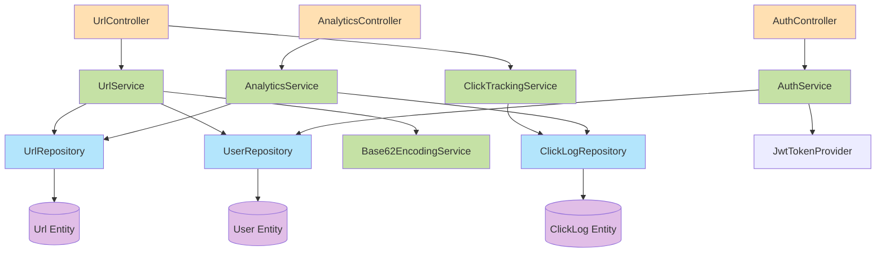
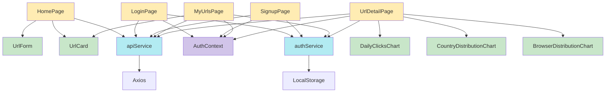
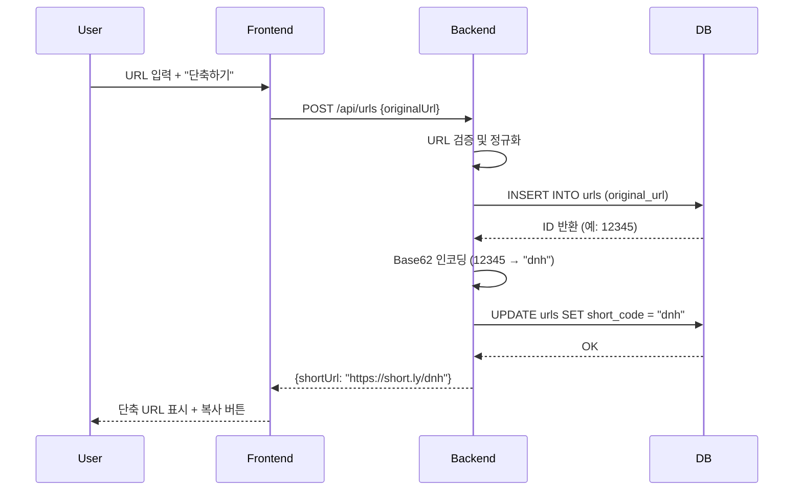
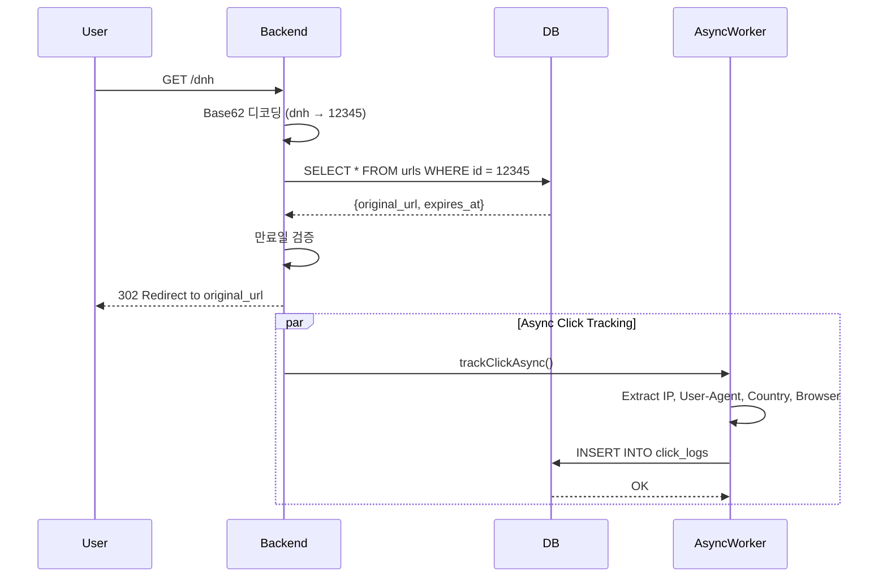
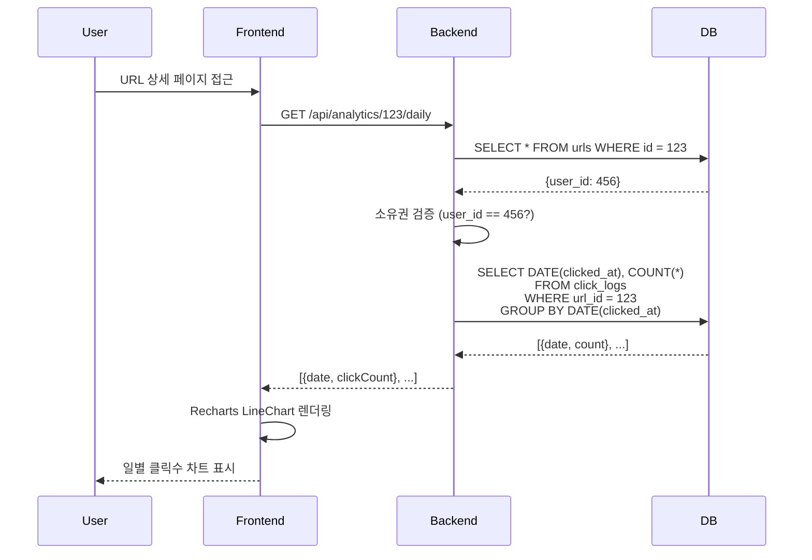
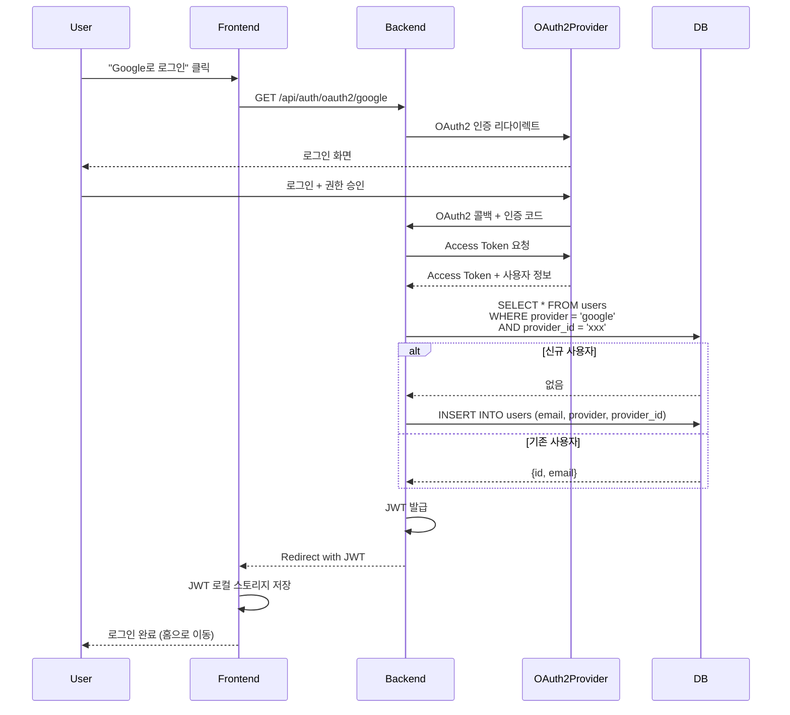

# Component Dependencies

컴포넌트 간 의존성 관계, 통신 패턴, 데이터 흐름을 정의합니다.

---

## Backend Dependency Matrix

### Controller → Service 의존성

| Controller | Depends On Services |
|---|---|
| UrlController | UrlService, ClickTrackingService |
| AnalyticsController | AnalyticsService |
| AuthController | AuthService |

### Service → Repository 의존성

| Service | Depends On Repositories |
|---|---|
| UrlService | UrlRepository, UserRepository (optional) |
| ClickTrackingService | ClickLogRepository |
| AnalyticsService | ClickLogRepository, UrlRepository |
| AuthService | UserRepository |
| Base62EncodingService | (None) |

### Service → Service 의존성

| Service | Depends On Services |
|---|---|
| UrlService | Base62EncodingService |
| AuthService | JwtTokenProvider |
| (Others) | (None) |

---

## Backend Dependency Graph



---

## Frontend Dependency Matrix

### Pages → Services 의존성

| Page | Depends On Services |
|---|---|
| HomePage | apiService |
| LoginPage | apiService, authService |
| SignupPage | apiService, authService |
| MyUrlsPage | apiService, authService |
| UrlDetailPage | apiService, authService |

### Pages → Components 의존성

| Page | Uses Components |
|---|---|
| HomePage | UrlForm, UrlCard, LoadingSpinner, ErrorMessage |
| LoginPage | LoadingSpinner, ErrorMessage |
| SignupPage | LoadingSpinner, ErrorMessage |
| MyUrlsPage | UrlCard, LoadingSpinner, ErrorMessage |
| UrlDetailPage | DailyClicksChart, CountryDistributionChart, BrowserDistributionChart, LoadingSpinner |

### Pages → Context 의존성

| Page | Uses Context |
|---|---|
| LoginPage | AuthContext (useAuth) |
| SignupPage | AuthContext (useAuth) |
| MyUrlsPage | AuthContext (useAuth) |
| UrlDetailPage | AuthContext (useAuth) |

---

## Frontend Dependency Graph



---

## Communication Patterns

### 1. REST API Communication (Frontend ↔ Backend)

**Pattern**: HTTP REST API (JSON)

**Endpoints**:

| HTTP Method | Endpoint | Description | Auth Required |
|---|---|---|---|
| POST | /api/urls | URL 생성 | No (익명 OK) |
| GET | /api/urls | 내 URL 목록 | Yes |
| GET | /api/urls/:id | URL 상세 | Yes |
| GET | /:shortCode | 리다이렉트 | No |
| GET | /api/analytics/:urlId/daily | 일별 통계 | Yes |
| GET | /api/analytics/:urlId/countries | 국가별 통계 | Yes |
| GET | /api/analytics/:urlId/browsers | 브라우저별 통계 | Yes |
| POST | /api/auth/signup | 회원 가입 | No |
| POST | /api/auth/login | 로그인 | No |
| POST | /api/auth/refresh | 토큰 갱신 | No (Refresh Token 필요) |

**인증 방식**:
- Authorization 헤더: `Bearer <JWT_ACCESS_TOKEN>`
- Axios Interceptor가 자동으로 헤더 추가

---

### 2. Database Communication (Backend ↔ Database)

**Pattern**: JPA/Hibernate ORM

**Repository → Database 매핑**:

| Repository | Table | Access Pattern |
|---|---|---|
| UrlRepository | urls | JPA findBy, custom JPQL |
| ClickLogRepository | click_logs | JPA save, custom JPQL (aggregation) |
| UserRepository | users | JPA findBy, existsBy |

**쿼리 전략**:
- **Simple Queries**: Spring Data JPA 메서드 이름 기반 (findByShortCode)
- **Complex Queries**: `@Query` + JPQL
- **Aggregation Queries**: `@Query` + Spring Data JPA Projection (DTO 직접 매핑)

---

### 3. Asynchronous Communication (Backend Internal)

**Pattern**: Spring `@Async`

**Async Flow**:
```
UrlController.redirect()
  ↓ (Synchronous)
UrlService.getOriginalUrl()
  ↓ (Return 302 immediately)
  ⚡ (Async - Fire and Forget)
ClickTrackingService.trackClickAsync()
  ↓
ClickLogRepository.save()
```

**Thread Pool**:
- Core Pool Size: 5
- Max Pool Size: 10
- Queue Capacity: 100

---

## Data Flow Diagrams

### 1. URL 생성 플로우



---

### 2. 리다이렉트 + 클릭 추적 플로우



---

### 3. 통계 조회 플로우



---

### 4. OAuth2 로그인 플로우



---

## Circular Dependency Prevention

### 규칙
1. **Controller → Service 단방향**: Controller는 Service를 호출하지만, Service는 Controller를 호출하지 않음
2. **Service → Repository 단방향**: Service는 Repository를 호출하지만, Repository는 Service를 호출하지 않음
3. **Service ↔ Service 순환 방지**: Service 간 의존성은 최소화하며, 순환 의존 금지

### 현재 설계 검증
- ✅ UrlService → Base62EncodingService (단방향)
- ✅ AuthService → JwtTokenProvider (단방향)
- ✅ 모든 Service → Repository (단방향)
- ✅ 순환 의존성 없음

---

## Technology Stack Mapping

### Backend Dependencies

| Component | Technology | Version |
|---|---|---|
| Framework | Spring Boot | 3.x |
| ORM | Spring Data JPA / Hibernate | 6.x |
| Database | PostgreSQL | 15 |
| Security | Spring Security | 6.x |
| OAuth2 | Spring Security OAuth2 Client | 6.x |
| JWT | jjwt (Java JWT) | 0.11.x |
| Password Encoding | BCrypt (Spring Security) | - |
| Geo IP | GeoLite2 (MaxMind) | 2.x |
| Async | Spring @Async | - |
| Validation | Jakarta Validation (Hibernate Validator) | 3.x |
| Database Migration | Flyway | 9.x |

### Frontend Dependencies

| Component | Technology | Version |
|---|---|---|
| Framework | React | 18.x |
| Routing | React Router | 6.x |
| HTTP Client | Axios | 1.x |
| State Management | React Context API + useState | - |
| Server State | React Query | 4.x |
| Charts | Recharts | 2.x |
| Styling | Tailwind CSS | 3.x |
| JWT Decode | jwt-decode | 3.x |

### Infrastructure Dependencies

| Component | Technology | Version |
|---|---|---|
| Containerization | Docker | 24.x |
| Orchestration | Docker Compose | 2.x |
| Database | PostgreSQL Docker Image | 15 |
| Reverse Proxy | Nginx (Frontend) | 1.25 |

---

## Summary

- **Backend Dependencies**: 명확한 3-tier 구조 (Controller → Service → Repository)
- **Frontend Dependencies**: Pages → Services/Components → Context
- **Communication Patterns**: REST API (JSON), JPA ORM, Spring @Async
- **Data Flows**: 4개 주요 플로우 (URL 생성, 리다이렉트, 통계 조회, OAuth2)
- **Circular Dependency**: 없음 (단방향 의존성 유지)
