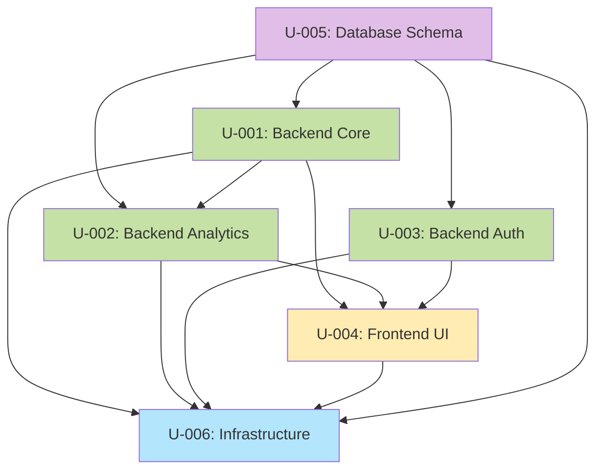

# Unit of Work Dependencies

Unit 간 의존성 관계, 개발 순서, 통합 포인트를 정의합니다.

---

## Dependency Matrix

### Unit Dependencies Table

| Unit | Depends On | Used By | Dependency Type |
|---|---|---|---|
| U-001 (Backend Core) | U-005 (Database) | U-002, U-004 | Data Access |
| U-002 (Backend Analytics) | U-001 (ClickLog entity), U-005 (Database) | U-004 | Data Access + Entity Reference |
| U-003 (Backend Auth) | U-005 (Database) | U-004 | Data Access |
| U-004 (Frontend UI) | U-001, U-002, U-003 (REST APIs) | - | REST API Client |
| U-005 (Database Schema) | - | U-001, U-002, U-003 | Database Schema Provider |
| U-006 (Infrastructure) | U-001, U-002, U-003, U-004, U-005 (All) | - | Container Orchestration |

### Dependency Graph



**Legend**:
- Purple: Database
- Green: Backend Services
- Yellow: Frontend
- Blue: Infrastructure

---

## Detailed Dependency Analysis

### U-001 (Backend Core) Dependencies

**Depends On**:
- **U-005 (Database Schema)**: Required
  - Tables: `urls`, `click_logs`
  - Reason: JPA 엔티티 매핑을 위한 스키마 필요
  - Integration Point: Spring Data JPA Repository

**Used By**:
- **U-002 (Backend Analytics)**:
  - Dependency: `ClickLog` 엔티티 사용
  - Reason: Analytics는 ClickLog 데이터를 집계
  - Integration Point: Shared Entity (JPA)

- **U-004 (Frontend UI)**:
  - Dependency: REST API (`UrlController`)
  - Endpoints: `POST /api/urls`, `GET /api/urls`, `GET /:shortCode`
  - Integration Point: HTTP REST API

**Circular Dependency Check**: ✅ None

---

### U-002 (Backend Analytics) Dependencies

**Depends On**:
- **U-001 (Backend Core)**:
  - Dependency: `ClickLog` 엔티티, `Url` 엔티티
  - Reason: 통계 집계를 위한 데이터 소스
  - Integration Point: Shared Entity (JPA)

- **U-005 (Database Schema)**:
  - Tables: `click_logs`, `urls`
  - Reason: 통계 쿼리 실행을 위한 스키마 필요
  - Integration Point: Spring Data JPA Repository

**Used By**:
- **U-004 (Frontend UI)**:
  - Dependency: REST API (`AnalyticsController`)
  - Endpoints: `GET /api/analytics/:urlId/daily`, `GET /api/analytics/:urlId/countries`, `GET /api/analytics/:urlId/browsers`
  - Integration Point: HTTP REST API

**Circular Dependency Check**: ✅ None (U-001 → U-002, not bidirectional)

---

### U-003 (Backend Auth) Dependencies

**Depends On**:
- **U-005 (Database Schema)**:
  - Tables: `users`
  - Reason: 사용자 인증 정보 저장 및 조회
  - Integration Point: Spring Data JPA Repository

**Used By**:
- **U-004 (Frontend UI)**:
  - Dependency: REST API (`AuthController`)
  - Endpoints: `POST /api/auth/signup`, `POST /api/auth/login`, `POST /api/auth/refresh`, `GET /api/auth/oauth2/{provider}`
  - Integration Point: HTTP REST API

**Circular Dependency Check**: ✅ None

---

### U-004 (Frontend UI) Dependencies

**Depends On**:
- **U-001 (Backend Core)**:
  - Dependency: URL Management REST API
  - Reason: URL 생성, 조회, 리다이렉트 기능
  - Integration Point: Axios HTTP Client

- **U-002 (Backend Analytics)**:
  - Dependency: Analytics REST API
  - Reason: 통계 데이터 시각화
  - Integration Point: Axios HTTP Client

- **U-003 (Backend Auth)**:
  - Dependency: Auth REST API
  - Reason: 로그인, 회원 가입, 토큰 관리
  - Integration Point: Axios HTTP Client + JWT Token

**Used By**: None (프론트엔드는 최상위 레이어)

**Circular Dependency Check**: ✅ None

---

### U-005 (Database Schema) Dependencies

**Depends On**: None (가장 하위 레이어, 독립적)

**Used By**:
- **U-001 (Backend Core)**: `urls`, `click_logs` 테이블
- **U-002 (Backend Analytics)**: `click_logs`, `urls` 테이블
- **U-003 (Backend Auth)**: `users` 테이블

**Circular Dependency Check**: ✅ None (Database는 항상 최하위 레이어)

---

### U-006 (Infrastructure) Dependencies

**Depends On**:
- **U-001, U-002, U-003 (Backend Units)**: Docker 이미지 빌드
- **U-004 (Frontend UI)**: Docker 이미지 빌드
- **U-005 (Database Schema)**: PostgreSQL 컨테이너

**Used By**: None (인프라는 통합 레이어)

**Circular Dependency Check**: ✅ None

---

## Integration Points

### 1. Backend ↔ Database (JPA)

**Units Involved**: U-001, U-002, U-003 → U-005

**Integration Pattern**: Spring Data JPA ORM

**Connection Details**:
```yaml
spring:
  datasource:
    url: jdbc:postgresql://db:5432/urlshortener
    username: admin
    password: secret
  jpa:
    hibernate:
      ddl-auto: validate  # Flyway manages schema
```

**Integration Test Strategy**:
- Testcontainers로 PostgreSQL 컨테이너 실행
- JPA Repository 통합 테스트 (`@DataJpaTest`)

---

### 2. Frontend ↔ Backend (REST API)

**Units Involved**: U-004 → U-001, U-002, U-003

**Integration Pattern**: HTTP REST API (JSON)

**API Base URL**:
- Development: `http://localhost:8080/api`
- Production: `http://backend:8080/api` (Docker 네트워크 내부)

**Authentication**:
- **Authorization Header**: `Bearer <JWT_ACCESS_TOKEN>`
- **Interceptor**: Axios Request Interceptor가 자동 추가

**Integration Test Strategy**:
- Frontend: Mock Service Worker (MSW)로 API Mocking
- Backend: `@WebMvcTest` + MockMvc

**CORS Configuration**:
```java
@Configuration
public class WebConfig implements WebMvcConfigurer {
    @Override
    public void addCorsMappings(CorsRegistry registry) {
        registry.addMapping("/api/**")
                .allowedOrigins("http://localhost:3000", "http://frontend")
                .allowedMethods("GET", "POST", "PUT", "DELETE")
                .allowedHeaders("*")
                .allowCredentials(true);
    }
}
```

---

### 3. Backend Unit ↔ Backend Unit (Entity Sharing)

**Units Involved**: U-001 → U-002

**Integration Pattern**: Shared JPA Entity

**Shared Entities**:
- `ClickLog` (U-001 writes, U-002 reads)
- `Url` (U-001 writes, U-002 reads for ownership verification)

**Integration Test Strategy**:
- 통합 테스트에서 U-001과 U-002의 Service 레이어를 함께 테스트
- `@SpringBootTest` + 실제 데이터베이스 사용

---

### 4. Infrastructure ↔ All Units (Docker Compose)

**Units Involved**: U-006 → U-001, U-002, U-003, U-004, U-005

**Integration Pattern**: Docker Compose Multi-Container

**Service Communication**:
- **Backend → Database**: `jdbc:postgresql://db:5432/urlshortener`
- **Frontend → Backend**: `http://backend:8080/api`

**Network**:
- Docker Compose 기본 브리지 네트워크 사용
- 서비스 이름으로 DNS 해결

**Integration Test Strategy**:
- `docker-compose up` 실행 후 E2E 테스트 (Cypress or Playwright)

---

## Development Sequence (Sequential)

### Phase 1: Database Foundation
**Unit**: U-005 (Database Schema)

**Why First**:
- 모든 백엔드 유닛이 데이터베이스에 의존
- Flyway 마이그레이션으로 스키마 버전 관리

**Completion Criteria**:
- [x] Flyway 마이그레이션 스크립트 작성 (`V1__`, `V2__`, `V3__`)
- [x] PostgreSQL 컨테이너 실행 가능
- [x] 테이블 및 인덱스 생성 확인

**Duration**: 1일

---

### Phase 2: Backend Core
**Unit**: U-001 (Backend Core)

**Why Second**:
- URL 단축 및 리다이렉트가 핵심 기능
- U-002는 U-001의 ClickLog 엔티티 사용

**Completion Criteria**:
- [x] `UrlController`, `UrlService`, `UrlRepository` 구현
- [x] Base62 인코딩 서비스 구현
- [x] 클릭 추적 비동기 처리 구현
- [x] 단위 테스트 + 통합 테스트 통과

**Dependencies**: U-005 (Database)

**Duration**: 3일

---

### Phase 3: Backend Analytics
**Unit**: U-002 (Backend Analytics)

**Why Third**:
- U-001의 ClickLog 엔티티 사용
- 통계 쿼리는 ClickLog 데이터 존재 필요

**Completion Criteria**:
- [x] `AnalyticsController`, `AnalyticsService` 구현
- [x] Spring Data JPA Projection으로 통계 쿼리 구현
- [x] 소유권 검증 로직 구현
- [x] 단위 테스트 + 통합 테스트 통과

**Dependencies**: U-001 (ClickLog entity), U-005 (Database)

**Duration**: 2일

---

### Phase 4: Backend Auth
**Unit**: U-003 (Backend Auth)

**Why Fourth**:
- 인증 기능은 독립적이지만, 백엔드 완료 후 프론트엔드 개발을 위해 백엔드 먼저 완성

**Completion Criteria**:
- [x] `AuthController`, `AuthService` 구현
- [x] JWT 토큰 발급/검증 구현
- [x] OAuth2 소셜 로그인 구현 (Google, GitHub)
- [x] Spring Security 설정 구현
- [x] 단위 테스트 + 통합 테스트 통과

**Dependencies**: U-005 (Database)

**Duration**: 3일

---

### Phase 5: Frontend UI
**Unit**: U-004 (Frontend UI)

**Why Fifth**:
- 백엔드 REST API가 완성된 후 프론트엔드 개발
- Material Design 3 (MUI) 적용

**Completion Criteria**:
- [x] MUI Theme 설정 (`theme.ts`)
- [x] React 페이지 및 컴포넌트 구현 (MUI 기반)
- [x] Axios Interceptor 설정 (JWT 자동 추가)
- [x] React Router 설정
- [x] Recharts 차트 컴포넌트 구현
- [x] E2E 테스트 통과

**Dependencies**: U-001, U-002, U-003 (REST APIs)

**Duration**: 4일

---

### Phase 6: Infrastructure Integration
**Unit**: U-006 (Infrastructure)

**Why Last**:
- 모든 유닛이 완성된 후 Docker Compose로 통합
- 전체 시스템 통합 테스트

**Completion Criteria**:
- [x] `docker-compose.yml` 작성
- [x] Backend Dockerfile 작성
- [x] Frontend Dockerfile + nginx.conf 작성
- [x] `docker-compose up`으로 전체 스택 실행 확인
- [x] E2E 테스트 (Cypress) 통과

**Dependencies**: All Units

**Duration**: 2일

---

## Total Estimated Timeline

| Phase | Unit | Duration |
|---|---|---|
| Phase 1 | U-005 (Database) | 1일 |
| Phase 2 | U-001 (Backend Core) | 3일 |
| Phase 3 | U-002 (Backend Analytics) | 2일 |
| Phase 4 | U-003 (Backend Auth) | 3일 |
| Phase 5 | U-004 (Frontend UI) | 4일 |
| Phase 6 | U-006 (Infrastructure) | 2일 |

**Total**: 15일 (약 2주)

**Note**: 학습용 프로젝트이므로 실제 개발 속도에 따라 조정 가능

---

## Parallel Development Opportunities

**Potential Parallel Tracks**:
- **Track 1**: U-001 (Backend Core) + U-003 (Backend Auth) - 독립적 구현 가능
- **Track 2**: U-002 (Backend Analytics) - U-001 완료 후

**Recommendation**: Sequential 방식 유지 (학습용 프로젝트이므로 단순화)

---

## Risk Assessment

### Dependency Risks

| Risk | Impact | Mitigation |
|---|---|---|
| U-002가 U-001의 ClickLog 엔티티 변경에 영향받음 | Medium | ClickLog 엔티티 변경 시 U-002 통합 테스트 실행 |
| Frontend가 백엔드 API 변경에 영향받음 | Medium | OpenAPI 3.0 (Swagger) 문서화로 API 계약 명확화 |
| Database 스키마 변경 시 모든 백엔드 유닛 영향 | High | Flyway 마이그레이션으로 스키마 버전 관리 |

### Integration Risks

| Risk | Impact | Mitigation |
|---|---|---|
| CORS 설정 누락으로 Frontend-Backend 통신 실패 | High | WebConfig에서 CORS 명시적 설정 |
| Docker 네트워크 내 서비스 통신 실패 | Medium | docker-compose.yml에서 depends_on 명시 |
| JWT 토큰 만료로 인한 401 에러 | Low | Axios Response Interceptor로 자동 로그아웃 처리 |

---

## Testing Strategy

### Unit-Level Testing

| Unit | Test Strategy |
|---|---|
| U-001 | `@WebMvcTest` (Controller), `@SpringBootTest` (Service), `@DataJpaTest` (Repository) |
| U-002 | `@WebMvcTest`, `@SpringBootTest`, `@DataJpaTest` (커스텀 쿼리 테스트) |
| U-003 | `@WebMvcTest`, `@SpringBootTest`, `@DataJpaTest` |
| U-004 | Jest + React Testing Library, MSW (API Mocking) |
| U-005 | Testcontainers로 PostgreSQL 컨테이너 실행 + Flyway 마이그레이션 검증 |
| U-006 | E2E 테스트 (Cypress) |

### Integration Testing

| Integration Point | Test Strategy |
|---|---|
| Backend ↔ Database | `@SpringBootTest` + Testcontainers |
| Frontend ↔ Backend | Cypress E2E 테스트 (전체 스택 실행) |
| Backend Unit ↔ Backend Unit | `@SpringBootTest` (U-001 + U-002 통합 테스트) |
| Infrastructure | `docker-compose up` + curl 테스트 |

---

## Summary

- **Total Units**: 6
- **Circular Dependencies**: None ✅
- **Development Sequence**: Sequential (U-005 → U-001 → U-002 → U-003 → U-004 → U-006)
- **Total Timeline**: 15일 (약 2주)
- **Parallel Development**: 가능하지만 학습용이므로 Sequential 권장
- **Risk Level**: Medium (의존성 관리 및 통합 테스트로 완화)

**Next Steps**:
1. Review unit-of-work-story-map.md for story-to-unit mapping
2. Proceed to CONSTRUCTION phase (Functional Design for Unit U-005)
