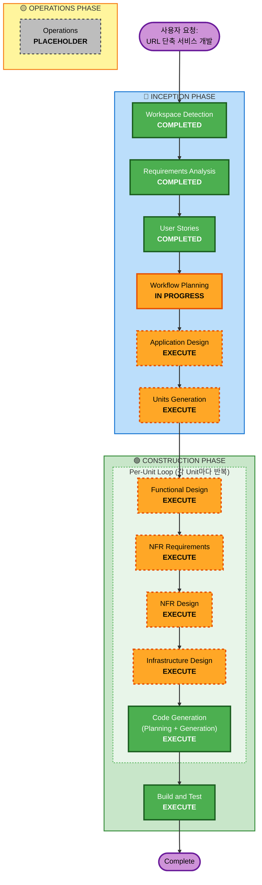

# Execution Plan

## Detailed Analysis Summary

### Project Type
**Greenfield Project** - 새로운 URL 단축 서비스 구축

### Primary Changes
- 새로운 Spring Boot 백엔드 애플리케이션 개발
- 새로운 React 프론트엔드 애플리케이션 개발
- PostgreSQL 데이터베이스 스키마 설계
- Docker Compose 기반 로컬 개발 환경 구축

### Change Impact Assessment

**User-facing changes**: Yes
- 익명 사용자용 URL 단축 기능
- 등록 사용자용 URL 관리 및 통계 대시보드
- 소셜 로그인 (Google, GitHub)

**Structural changes**: Yes
- 새로운 Spring Boot 백엔드 (REST API)
- 새로운 React 프론트엔드 (SPA)
- 새로운 PostgreSQL 데이터베이스
- Docker Compose 멀티 컨테이너 아키텍처

**Data model changes**: Yes
- 새로운 테이블: users, urls, click_logs
- Flyway 마이그레이션 스크립트 필요

**API changes**: Yes
- 새로운 REST API 엔드포인트 설계
  - URL 단축 API
  - 리다이렉트 API
  - 통계 조회 API
  - 회원 인증 API

**NFR impact**: Yes
- 성능: 리다이렉트 응답 시간 200ms 이내
- 보안: JWT 인증, BCrypt 비밀번호 암호화, OAuth2 소셜 로그인
- 확장성: 비동기 클릭 로그 처리 (@Async)
- 관찰성: Spring Boot Actuator, 로깅

### Risk Assessment
- **Risk Level**: Medium
  - 학습용 프로젝트로 비즈니스 로직은 단순하나, 풀스택 통합 복잡도 존재
  - 여러 기술 스택 (Spring Boot, React, PostgreSQL, Docker) 통합 필요
  - OAuth2 소셜 로그인 구현 필요
- **Rollback Complexity**: Easy
  - 로컬 개발 환경 전용, Docker Compose로 쉽게 재시작 가능
- **Testing Complexity**: Moderate
  - 단위 테스트 (JUnit, React Testing Library)
  - API 통합 테스트
  - 프론트엔드-백엔드 통합 테스트

---

## Workflow Visualization

---

## Phases to Execute

### 🔵 INCEPTION PHASE

- [x] **Workspace Detection** - COMPLETED
  - Greenfield 프로젝트 확인 완료
  - 기존 코드 없음, 새로운 워크스페이스

- [x] **Requirements Analysis** - COMPLETED
  - 14개 검증 질문에 대한 답변 수집 완료
  - 6개 기능 요구사항, 6개 비기능 요구사항 문서화
  - 기술 스택: Spring Boot + React + PostgreSQL + Docker Compose

- [x] **User Stories** - COMPLETED
  - 3개 페르소나 생성 (익명 사용자, 등록 사용자, 소셜 로그인 사용자)
  - 13개 사용자 스토리 생성 (Must Have: 10개, Should Have: 2개)
  - INVEST 원칙 준수 확인

- [x] **Workflow Planning** - IN PROGRESS
  - 실행 계획 수립 중

- [ ] **Application Design** - **EXECUTE**
  - **Rationale**: 새로운 백엔드 서비스와 프론트엔드 컴포넌트 설계 필요
  - **설계 범위**:
    - Spring Boot 컴포넌트 구조 (Controller, Service, Repository)
    - React 컴포넌트 구조 (페이지, 공통 컴포넌트)
    - REST API 엔드포인트 설계
    - 데이터베이스 스키마 설계
    - 컴포넌트 간 의존성 및 상호작용

- [ ] **Units Generation** - **EXECUTE**
  - **Rationale**: 시스템을 구현 가능한 단위로 분해 필요
  - **예상 Units**:
    1. Backend - URL Management Service
    2. Backend - Analytics Service
    3. Backend - Authentication Service
    4. Frontend - URL Creation & Management UI
    5. Frontend - Analytics Dashboard UI
    6. Database - Schema & Migrations
    7. Infrastructure - Docker Compose Setup

### 🟢 CONSTRUCTION PHASE

**Per-Unit 단계** (각 Unit마다 순차적으로 실행):

- [ ] **Functional Design** - **EXECUTE** (각 Unit마다)
  - **Rationale**:
    - 새로운 데이터 모델 (users, urls, click_logs) 설계 필요
    - 비즈니스 로직 (Base62 인코딩, 클릭 추적, 통계 집계) 설계 필요
    - React 컴포넌트 상태 관리 및 UI 플로우 설계 필요
  - **설계 범위**:
    - 엔티티 모델 및 JPA 매핑
    - 비즈니스 로직 메서드 시그니처
    - React 컴포넌트 props 및 state
    - API 요청/응답 DTO

- [ ] **NFR Requirements** - **EXECUTE** (각 Unit마다)
  - **Rationale**:
    - 성능 요구사항: 리다이렉트 응답 시간 200ms 이하
    - 보안 요구사항: JWT 인증, BCrypt, OAuth2
    - 확장성 요구사항: 비동기 클릭 로그 처리
    - 관찰성 요구사항: 로깅, 모니터링
  - **NFR 범위**:
    - 성능 최적화 전략
    - 보안 패턴 선택
    - 확장성 설계
    - 로깅 및 모니터링 전략

- [ ] **NFR Design** - **EXECUTE** (각 Unit마다)
  - **Rationale**: NFR 요구사항을 구체적인 설계 패턴으로 변환 필요
  - **설계 범위**:
    - Spring Security + JWT 설정
    - OAuth2 Client 설정 (Google, GitHub)
    - @Async 설정 및 ThreadPoolExecutor 구성
    - Flyway 마이그레이션 전략
    - 로깅 프레임워크 설정 (Logback)

- [ ] **Infrastructure Design** - **EXECUTE** (각 Unit마다)
  - **Rationale**: Docker Compose 기반 로컬 개발 환경 구축 필요
  - **설계 범위**:
    - Docker Compose 서비스 정의 (db, backend, frontend)
    - 네트워크 구성
    - 볼륨 마운트 (PostgreSQL 데이터 영속성)
    - 환경 변수 설정
    - 빌드 전략 (멀티스테이지 빌드)

- [ ] **Code Generation** - **EXECUTE** (ALWAYS, 각 Unit마다)
  - **Rationale**: 실제 구현 코드 생성 필요
  - **생성 범위**:
    - Spring Boot 애플리케이션 코드
    - React 애플리케이션 코드
    - Flyway 마이그레이션 스크립트
    - Docker Compose 파일
    - 단위 테스트 및 통합 테스트 코드

**통합 단계**:

- [ ] **Build and Test** - **EXECUTE** (ALWAYS)
  - **Rationale**: 전체 시스템 빌드 및 테스트 필요
  - **검증 범위**:
    - Spring Boot 애플리케이션 빌드 (Gradle/Maven)
    - React 애플리케이션 빌드 (npm/yarn)
    - 단위 테스트 실행
    - API 통합 테스트 실행
    - Docker Compose 전체 스택 시작 및 통합 테스트

### 🟡 OPERATIONS PHASE

- [ ] **Operations** - **PLACEHOLDER**
  - **Rationale**: 로컬 개발 환경 전용 프로젝트, 배포 및 운영은 향후 확장 포인트

---

## Estimated Timeline

**총 단계 수**: 약 10단계 (Application Design, Units Generation, 7개 Unit별 설계/코드 생성, Build and Test)

**예상 소요 시간**: 2주 (학습용 프로젝트 기준)
- Week 1: INCEPTION (Application Design, Units Generation) + CONSTRUCTION 시작 (Core Features)
- Week 2: CONSTRUCTION 완료 (Authentication, Dashboard, Advanced Features) + Build and Test

**단계별 예상 시간**:
- Application Design: 2-3시간
- Units Generation: 1-2시간
- 각 Unit 설계 및 코드 생성: 3-5시간 × 7 units = 21-35시간
- Build and Test: 2-3시간

---

## Success Criteria

**Primary Goal**:
로컬 환경에서 동작하는 풀스택 URL 단축 서비스 구축 (학습용)

**Key Deliverables**:
1. Spring Boot 백엔드 애플리케이션
   - URL 단축 및 리다이렉트 기능
   - 클릭 추적 및 통계 API
   - JWT 인증 및 OAuth2 소셜 로그인
2. React 프론트엔드 애플리케이션
   - URL 생성 UI
   - 통계 대시보드 (일별, 국가별, 브라우저별 차트)
3. PostgreSQL 데이터베이스
   - 스키마 마이그레이션 (Flyway)
4. Docker Compose 설정
   - 전체 스택 로컬 실행 환경

**Quality Gates**:
- 모든 Must Have 사용자 스토리 구현 완료 (10개)
- 단위 테스트 커버리지: 주요 비즈니스 로직 커버
- API 통합 테스트: 모든 엔드포인트 정상 동작
- Docker Compose로 전체 스택 시작 성공
- 리다이렉트 응답 시간 200ms 이하 달성

**학습 목표 달성**:
- Spring Boot REST API 개발 경험
- React SPA 개발 경험
- JWT 인증 및 OAuth2 소셜 로그인 구현 경험
- PostgreSQL 데이터베이스 설계 및 Flyway 마이그레이션 경험
- Docker Compose 멀티 컨테이너 환경 구성 경험
